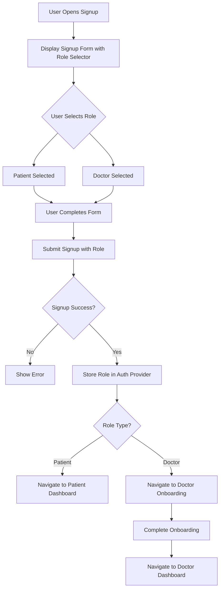
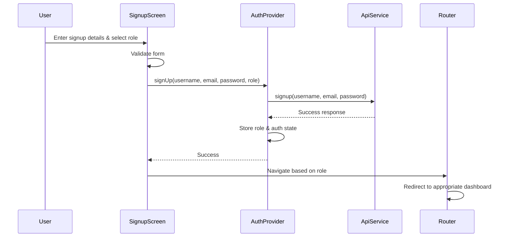

# Design Document

## Overview

This design implements role selection during signup and ensures proper role-based dashboard routing. The solution reuses the existing role selector UI from the login screen, integrates it into the signup flow, and enhances the authentication provider to handle role persistence and routing logic.

## Architecture

### High-Level Flow



### Component Interaction



## Components and Interfaces

### 1. Role Selector Widget (New Reusable Component)

**Purpose:** Extract the role selection UI from LoginScreen into a reusable widget

**Location:** `lib/widgets/role_selector.dart`

**Interface:**
```dart
class RoleSelector extends StatelessWidget {
  final UserRole selectedRole;
  final ValueChanged<UserRole> onRoleChanged;
  final bool enabled;
  
  const RoleSelector({
    required this.selectedRole,
    required this.onRoleChanged,
    this.enabled = true,
  });
}
```

**Features:**
- Visual cards for Patient and Doctor roles
- Icons and labels for each role
- Selected state indication with border and checkmark
- Disabled state support during loading
- Consistent styling with app theme

### 2. Updated SignupScreen

**Changes Required:**
- Add `_selectedRole` state variable (default: `UserRole.patient`)
- Import and integrate `RoleSelector` widget
- Update `_handleSignup()` to pass role to AuthProvider
- Update navigation logic based on role after successful signup
- Disable role selector during loading state

**Key Methods:**
```dart
Future<void> _handleSignup() async {
  // Validate form
  // Call auth.signUp() with role parameter
  // Navigate based on role:
  //   - Patient: go to '/'
  //   - Doctor: go to '/doctor-onboarding'
}
```

### 3. Updated AuthProvider

**Changes Required:**
- Update `signUp()` method signature to accept `UserRole role` parameter
- Store role during signup process
- Set `_onboardingCompleted` based on role (patients skip onboarding)
- Persist role to SharedPreferences

**Updated Method Signature:**
```dart
Future<Map<String, dynamic>> signUp({
  required String username,
  required String email,
  required String password,
  required UserRole role,
}) async
```

### 4. Updated Router Logic

**Current State:** Router already handles role-based redirection in the `redirect` callback

**Verification Needed:**
- Ensure redirect logic properly handles post-signup navigation
- Confirm doctor onboarding flow works correctly
- Verify patient users skip onboarding

**No changes required** - existing router logic already supports the requirements.

## Data Models

### UserRole Enum (Existing)

```dart
enum UserRole { patient, doctor }
```

**Storage Format:** String values 'patient' or 'doctor' in SharedPreferences

### AuthProvider State (Enhanced)

```dart
class AuthProvider {
  bool _isLoggedIn;
  String? _email;
  UserRole? _role;  // Enhanced: Now set during signup
  bool _onboardingCompleted;  // Enhanced: Set based on role
  
  // SharedPreferences keys
  static const String _keyRole = 'auth.role';
  static const String _keyOnboardingCompleted = 'auth.onboardingCompleted';
}
```

## UI/UX Design

### Signup Screen Layout

```
┌─────────────────────────────────────┐
│          [EyeCloud Logo]            │
│                                     │
│         Create Your Account         │
│                                     │
│  ┌───────────────────────────────┐ │
│  │ Username                      │ │
│  └───────────────────────────────┘ │
│                                     │
│  ┌───────────────────────────────┐ │
│  │ Email Address                 │ │
│  └───────────────────────────────┘ │
│                                     │
│  ┌───────────────────────────────┐ │
│  │ Password                      │ │
│  └───────────────────────────────┘ │
│                                     │
│  ┌───────────────────────────────┐ │
│  │   Choose Account Type         │ │
│  │                               │ │
│  │  ┌──────────┐  ┌──────────┐  │ │
│  │  │ Patient  │  │  Doctor  │  │ │
│  │  │   [✓]    │  │          │  │ │
│  │  └──────────┘  └──────────┘  │ │
│  └───────────────────────────────┘ │
│                                     │
│  ┌───────────────────────────────┐ │
│  │        Sign Up                │ │
│  └───────────────────────────────┘ │
│                                     │
│    Already have an account?        │
│           Sign In                  │
└─────────────────────────────────────┘
```

### Role Selector Component Styling

**Patient Card:**
- Icon: `Icons.person`
- Label: "Patient"
- Selected: Primary color border (2px), checkmark icon, light background tint

**Doctor Card:**
- Icon: `Icons.medical_services`
- Label: "Doctor"
- Selected: Primary color border (2px), checkmark icon, light background tint

**Unselected State:**
- Border: Muted border color (1px)
- Background: Transparent
- No checkmark

## Error Handling

### Signup Validation Errors

1. **Missing Role Selection:** Prevented by default selection (Patient)
2. **Form Validation Errors:** Existing validation continues to work
3. **API Errors:** Existing error handling in SignupScreen continues to work
4. **Network Errors:** Existing error handling continues to work

### Navigation Errors

1. **Invalid Role State:** Router redirect handles missing/invalid roles by redirecting to login
2. **Onboarding State Mismatch:** Router checks `needsOnboarding` flag and redirects appropriately

### State Persistence Errors

1. **SharedPreferences Failure:** Caught and logged, user remains logged in for current session
2. **Role Not Persisted:** Router redirect will catch and redirect to login on next app launch

## Testing Strategy

### Unit Tests

1. **RoleSelector Widget Tests**
   - Renders both role options
   - Calls onRoleChanged when role is tapped
   - Shows correct selected state
   - Respects enabled/disabled state

2. **AuthProvider Tests**
   - signUp() stores role correctly
   - signUp() sets onboardingCompleted based on role
   - Role persists to SharedPreferences
   - Role loads from SharedPreferences on app restart

### Integration Tests

1. **Signup Flow Test**
   - Complete signup as Patient → navigates to home
   - Complete signup as Doctor → navigates to onboarding
   - Role persists after app restart

2. **Login Flow Test**
   - Login with Patient role → navigates to home
   - Login with Doctor role (onboarding incomplete) → navigates to onboarding
   - Login with Doctor role (onboarding complete) → navigates to doctor dashboard

### Manual Testing Checklist

- [ ] Signup as Patient → verify navigation to Patient Dashboard
- [ ] Signup as Doctor → verify navigation to Doctor Onboarding
- [ ] Complete Doctor Onboarding → verify navigation to Doctor Dashboard
- [ ] Close and reopen app → verify role persists and correct dashboard loads
- [ ] Logout and login → verify role selector works and correct dashboard loads
- [ ] Visual consistency between signup and login role selectors
- [ ] Role selector disabled state during loading
- [ ] Error handling for failed signup with role selected

## Implementation Notes

### Code Reusability

The role selector UI currently exists in `LoginScreen`. To maximize reusability:
1. Extract the role selector into a separate widget
2. Use the same widget in both LoginScreen and SignupScreen
3. Maintain consistent styling through shared theme

### Backward Compatibility

Existing users who signed up before this feature:
- Will have `_role` set during login (existing behavior)
- Login screen already handles role selection
- No migration needed for existing user data

### Performance Considerations

- Role selector is a lightweight stateless widget
- No additional API calls required
- SharedPreferences operations are async but fast
- No impact on app startup time

## Dependencies

### Existing Dependencies (No Changes)
- `shared_preferences`: For role persistence
- `go_router`: For navigation
- `provider`: For state management

### New Files
- `lib/widgets/role_selector.dart`: New reusable widget

### Modified Files
- `lib/screens/signup_screen.dart`: Add role selector and update signup logic
- `lib/providers/auth_provider.dart`: Update signUp method signature
- `lib/screens/login_screen.dart`: Refactor to use new RoleSelector widget
