# EyeWise Connect - System Architecture

## Complete System Architecture Diagram

```mermaid
graph TB
    subgraph "Frontend Layer"
        FA[Flutter Mobile App<br/>- Camera access<br/>- Login & Dashboard<br/>- Doctor booking<br/>- Sends images + requests]
        style FA fill:#B3D9FF,stroke:#333,stroke-width:2px
    end

    subgraph "Monitoring & Ops"
        MON[Cloud Logging + Tracing<br/>Error & performance<br/>analytics]
        style MON fill:#FFF4CC,stroke:#333,stroke-width:2px
    end

    subgraph "Data & Security"
        IAM[IAM<br/>Access control & roles]
        RDS[RDS<br/>Patient & doctor records]
        OBS[OBS<br/>Medical images + AI reports]
        style IAM fill:#F0F0F0,stroke:#333,stroke-width:2px
        style RDS fill:#F0F0F0,stroke:#333,stroke-width:2px
        style OBS fill:#F0F0F0,stroke:#333,stroke-width:2px
    end

    subgraph "API Management"
        APIG[Huawei API Gateway<br/>- Secure routing<br/>- Auth & Throttling<br/>- Monitoring]
        style APIG fill:#E6D5F5,stroke:#333,stroke-width:2px
    end

    subgraph "Backend"
        BE[Huawei FunctionGraph<br/>Handles app logic: sign up,<br/>login,<br/>doctorOnboarding Function<br/>Triggers AI inference<br/>workflows]
        style BE fill:#D5F5E3,stroke:#333,stroke-width:2px
    end

    subgraph "Smart Conversational Interface"
        CHAT[Hybrid AI Chatbot<br/>- Huawei SIS + STT & TTS<br/>- DeepSeek LLM: Medical<br/>Q&A<br/>- Interactive user support]
        style CHAT fill:#FFD9E6,stroke:#333,stroke-width:2px
    end

    subgraph "AI & Vision Analysis"
        AI[Huawei ModelArts<br/>- Model A: Selfie Vision<br/>Assessment<br/>- Model B: Fundus Retinal<br/>Disease Detection<br/>- Real-time inference APIs]
        style AI fill:#FFE6CC,stroke:#333,stroke-width:2px
    end

    %% Connections
    FA -->|Images + API Requests| APIG
    FA -->|Logs & Traces| MON
    
    APIG -->|Secure Routes| BE
    APIG -->|Logs & Traces| MON
    
    BE -->|CRUD Operations| RDS
    BE -->|Access Control| IAM
    BE -->|Requests/Responses| CHAT
    BE -->|Triggers Inference| AI
    BE -->|Stores Results| OBS
    BE -->|Logs & Traces| MON
    
    IAM -->|Access Control| APIG
    IAM -->|Access Control| BE
    
    CHAT -->|Logs & Traces| MON
    AI -->|Logs & Traces| MON
    
    RDS -->|Stores Results| OBS
```



## Detailed Component Architecture

### 1. Frontend Layer
**Flutter Mobile App**
- Cross-platform (iOS, Android, Web)
- Camera integration for retinal/selfie capture
- User authentication (login/signup)
- Doctor appointment booking
- Real-time chat interface
- Image upload and analysis
- Results visualization

**Key Features:**
- Responsive UI with Material Design
- Offline-first architecture
- Secure local storage
- Push notifications
- Multi-language support

---

### 2. API Management Layer
**Huawei API Gateway (APIG)**
- Centralized API routing
- Request authentication and authorization
- Rate limiting and throttling
- API versioning
- Request/response transformation
- Monitoring and analytics

**Security Features:**
- AppCode authentication
- IAM integration
- CORS handling
- SSL/TLS encryption
- DDoS protection

---

### 3. Backend Layer
**Huawei FunctionGraph (Serverless)**
- User registration and authentication
- Doctor onboarding workflow
- Appointment management
- AI inference orchestration
- Data validation and processing
- Business logic execution

**Functions:**
- `signup`: User registration with bcrypt hashing
- `login`: Authentication and token generation
- `doctorOnboarding`: Doctor profile creation
- `bookAppointment`: Appointment scheduling
- `triggerInference`: AI model invocation
- `processResults`: Result storage and notification

---

### 4. Smart Conversational Interface
**Hybrid AI Chatbot**

**Components:**
- **Huawei SIS (Speech Interaction Service)**
  - Speech-to-Text (STT)
  - Text-to-Speech (TTS)
  - Real-time transcription
  - Multi-language support

- **DeepSeek LLM**
  - Medical Q&A
  - Symptom analysis
  - Health recommendations
  - Context-aware responses

**Features:**
- Voice-enabled chat
- Natural language understanding
- Medical knowledge base
- Appointment booking assistance
- Multilingual support (English, Arabic)

---

### 5. AI & Vision Analysis
**Huawei ModelArts**

**Model A: Selfie Vision Assessment**
- Input: Smartphone selfie images
- Analysis: Eye appearance, redness, swelling
- Output: Preliminary assessment
- Confidence score: 0-1

**Model B: Fundus Retinal Disease Detection**
- Input: Professional retinal scans
- Analysis: Diabetic retinopathy, glaucoma, AMD
- Output: Disease classification and severity
- Confidence score: 0-1

**Inference Pipeline:**
1. Image preprocessing (resize, normalize)
2. Model inference (GPU-accelerated)
3. Post-processing (confidence thresholding)
4. Result formatting (JSON response)

---

### 6. Data & Security Layer

**IAM (Identity and Access Management)**
- User authentication
- Role-based access control (RBAC)
- Token management (JWT)
- Permission enforcement
- Audit logging

**RDS (Relational Database Service)**
- User profiles (patients, doctors)
- Appointment records
- Medical history
- Chat logs
- System configuration

**OBS (Object Storage Service)**
- Medical images (retinal scans, selfies)
- AI analysis reports (PDF)
- User profile images
- Backup data
- Audit logs

---

### 7. Monitoring & Operations

**Cloud Logging + Tracing**
- Application logs
- Error tracking
- Performance metrics
- User activity monitoring
- Security audit logs

**Monitoring Tools:**
- Huawei Cloud APM
- Custom dashboards
- Real-time alerts
- Performance analytics
- Cost optimization

---

## Data Flow Examples

### User Authentication Flow
```
User → Flutter App → APIG → FunctionGraph (login) → IAM → RDS
                                                    ↓
                                              JWT Token
                                                    ↓
                                            Flutter App (Store)
```

### AI Diagnosis Flow
```
User → Flutter App (Capture Image) → APIG → FunctionGraph
                                              ↓
                                        Upload to OBS
                                              ↓
                                        ModelArts Inference
                                              ↓
                                        Store Result in RDS
                                              ↓
                                        Return to Flutter App
```

### Voice Chat Flow
```
User → Flutter App (Record Audio) → APIG → FunctionGraph
                                              ↓
                                        SIS (Transcribe)
                                              ↓
                                        DeepSeek LLM (Process)
                                              ↓
                                        SIS (TTS)
                                              ↓
                                        Return to Flutter App
```

### Appointment Booking Flow
```
User → Flutter App → APIG → FunctionGraph (bookAppointment)
                                ↓
                          Check Doctor Availability (RDS)
                                ↓
                          Create Appointment Record
                                ↓
                          Send Notification
                                ↓
                          Return Confirmation
```

---

## Security Architecture

### Authentication Flow
```
1. User enters credentials
2. Flutter App → APIG (with AppCode)
3. APIG → FunctionGraph (validate)
4. FunctionGraph → IAM (authenticate)
5. IAM → Generate JWT Token
6. Token → Flutter App (store securely)
7. Subsequent requests include JWT in header
```

### Data Encryption
- **In Transit**: TLS 1.2+ for all communications
- **At Rest**: AES-256 encryption for OBS storage
- **Database**: Encrypted RDS with automatic backups
- **Credentials**: Bcrypt hashing for passwords

### Access Control
- **Patient Role**: View own records, book appointments
- **Doctor Role**: View assigned patients, manage appointments
- **Admin Role**: System configuration, user management

---

## Scalability Strategy

### Horizontal Scaling
- **FunctionGraph**: Auto-scales based on request volume
- **APIG**: Handles millions of requests per second
- **RDS**: Read replicas for query distribution
- **ModelArts**: GPU cluster auto-scaling

### Caching Strategy
- **API Gateway**: Response caching (TTL: 5 minutes)
- **Application**: Redis cache for frequent queries
- **CDN**: Static asset distribution
- **Browser**: Client-side caching

### Load Distribution
- **Geographic**: Multi-region deployment
- **Service**: Microservices architecture
- **Database**: Sharding by user ID
- **Storage**: Distributed object storage

---

## Disaster Recovery

### Backup Strategy
- **RDS**: Daily automated backups (7-day retention)
- **OBS**: Cross-region replication
- **Configuration**: Version-controlled infrastructure as code
- **Logs**: 90-day retention in cold storage

### Recovery Procedures
- **RTO (Recovery Time Objective)**: < 1 hour
- **RPO (Recovery Point Objective)**: < 15 minutes
- **Failover**: Automatic to standby region
- **Testing**: Quarterly DR drills

---

## Cost Optimization

### Resource Management
- **FunctionGraph**: Pay-per-invocation model
- **ModelArts**: GPU instances only during inference
- **RDS**: Right-sized instances with auto-scaling
- **OBS**: Lifecycle policies for old data

### Monitoring
- **Cost Dashboard**: Real-time cost tracking
- **Alerts**: Budget threshold notifications
- **Optimization**: Regular resource utilization review
- **Reserved Instances**: Long-term commitment discounts

---

**Document Version**: 1.0  
**Last Updated**: 2024-01-15  
**Status**: Final Architecture
